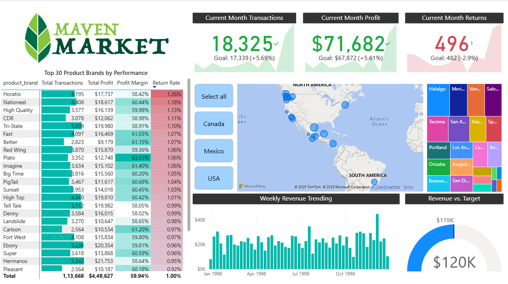

# Maven Market: Multi-National Sales & Performance Analytics

>*"**Note:** Above is a preview of the main interactive dashboard. Download the **[Maven_Market_Project_Analytics.pbix](Maven_Market_Project_Analytics.pbix)** file to explore fully."*

---

## Business Problem
Maven Market, a multi-national grocery chain with locations in Canada, Mexico, and the United States, faced challenges in consolidating sales data from disparate CSV files.

**The company lacked visibility into:**
* **Global Performance:** No unified view of sales trends across different regions.
* **Return Patterns:** Inability to identify high-return products (specifically "High Top" brand in Mexico) affecting net profit.
* **Profitability:** Difficulty in tracking profit margins per product brand due to disconnected cost and revenue data sources.

---

## Project Overview
This project is an end-to-end business intelligence solution. The goal was to transform raw transactional data into a business-ready dashboard that enables leadership to monitor performance, profitability, returns, and growth trends.

## Key Performance Metrics

### 1. Data Model Scope (Backend)
*Total volume of data processed in the model (1997-1998)*
* **Total Records Analyzed:** 269,720 Transactions
* **Total Lifetime Revenue:** $1.76M
* **Total Profit:** $1.05M
* **Regions Covered:** USA, Canada, Mexico

### 2. Dashboard Focus (Frontend)
*The interactive dashboard view is specifically filtered to highlight:*
* **Time Period:** Fiscal Year 1998
* **Entity Scope:** Top 30 Performing Product Brands
* **Target Audience:** Executive Management & Regional Managers

---

## Top Business Insights
* **Regional Milestones:** The Portland store successfully crossed the 1,000 transactions milestone in December.
* **Product Performance:** "Plato" brand products delivered the highest profit margin at **63.55%**.
* **Returns Analysis:** While the overall return rate is low (~1%), returns for "High Top" products doubled in Mexico, warranting investigation.
* **Seasonality:** A strong seasonal lift in sales was observed during late-year months (Nov-Dec).

---

## Tools & Technologies
* **Power BI Desktop:** Dashboard design and interactivity.
* **Power Query:** ETL processing (Data Cleaning & Transformation).
* **DAX (Data Analysis Expressions):** Used for time-intelligence (MoM, YTD) and logic-based KPIs.
* **Data Modeling:** Built a Star Schema with `Transactions` and `Returns` as fact tables, connected to lookup tables (`Customers`, `Products`, `Regions`).

## Data Model Structure

* **Fact Tables:** Transaction_Data, Return_Data
* **Dimension Tables:** Customers, Products, Stores, Regions, Calendar
* **Relationships:** One-to-Many relationships with single-direction filtering to ensure accurate drill-downs.

## How to Run This Project
1.  Download the file **[Maven_Market_Project_Analytics.pbix](Maven_Market_Project_Analytics.pbix)** from this repository.
2.  Open it in **Power BI Desktop**.
3.  Interact with the "Country" slicers to filter the data by region.
4.  Hover over charts to see custom tooltips for specific product performance.

---
## 🤝 Connect with Me
I am currently **Open to Work** and actively seeking full-time **Data Analyst** opportunities. If you are looking for someone who can transform raw data into actionable insights, I would love to chat!

* 💼 **LinkedIn:** [Let's Connect!](https://www.linkedin.com/in/firdaus-parvez/)
* 📧 **Email:** [firdaus.parvez290@gmail.com](mailto:firdaus.parvez290@gmail.com)

